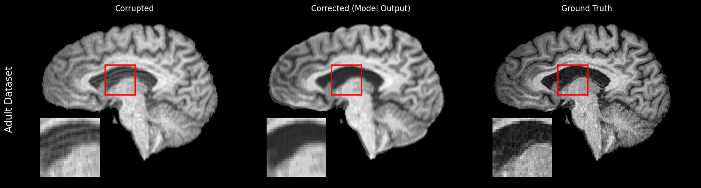
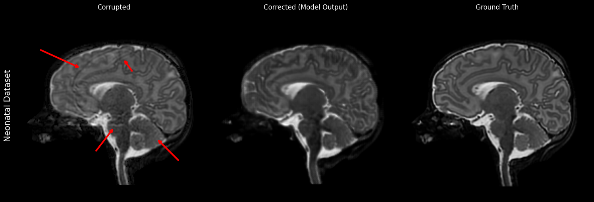

[//]: # (# Evaluating Deep Learning Based Domain Generalization for Motion Mitigation in Multi-Center Brain MRI)

[//]: # (This repository contains the codes for the paper "Evaluating Deep Learning Based Domain Generalization for Motion Mitigation in Multi-Center Brain MRI".)

[//]: # ()
[//]: # (# Instruction)

[//]: # (TBD)

[//]: # (<div align="center">)
# Deep Learning Domain Adaptation in Brain MRI: Investigating Motion Mitigation in Adult and Neonatal Scans
[//]: # (</div>)
<a href='https://www.python.org/downloads/'></a>
<a href='https://opensource.org/license/mit'></a>
<a href='https://link.springer.com/chapter/10.1007/978-3-032-06103-4_6'></a>
<br><br>

<p align="center">
  
</p>

[//]: # (<br>)
<p align="center">
  
</p>

[//]: # (## Overview <a name="overview"></a>)
Deep learning models tend to degrade due to difference in MRI datasets coming from scanners, 
acquisition protocols, and preprocessing pipelines. As a widely used non-invasive 
imaging modality, ensuring cross-center generalization is essential. Motion artifacts further degrade 
image quality, impacting both clinical assessment and downstream models. While prior work has explored 
deep learning for motion mitigation in adults, its effectiveness in diverse, multi-center MRI settings 
remains underexplored. Additionally, existing works are performed on closed data whereas our objective
is to promote open and reproducible research.

<I>So in this work, we ask:</I> <br>
<b>(1) How would a baseline deep learning model for motion mitigation generalize on 
multi-center MRI datasets? <br>
(2) How would the same baseline model behave on the neonatal domain?</b>

This repository contains codes for the experiments we have run in our project.  Given the significant differences between neonatal and adult MRI and the scarcity of neonatal datasets, 
this setting helps identify the limits of baseline models and the conditions under which they fail. We 
also address the open and reproducible aspects of research in this sector, which is another gap in the literature.

## Papers <a name="news"></a>
**Evaluating Deep Learning Based Domain Generalization for Motion Mitigation in Multi-center Brain MRI**<br>
<a href="https://scholar.google.com/citations?user=QeWqb7gAAAAJ&hl=en">Saad Ashraf</a>, 
<a href="https://scholar.google.com/citations?user=XuauQRIAAAAJ&hl=en">Md Afif Al Mamun</a>, 
<a href="https://scholar.google.com/citations?user=EBFetcQAAAAJ&hl=en">Mumu Aktar</a>, 
<a href="https://scholar.google.com/citations?user=G2V4oBIAAAAJ&hl=en">Roberto Souza</a>, 
<a href="https://scholar.google.com/citations?user=3DxVbpcAAAAJ&hl=pt-BR">Mariana Bento</a>
<br>
<I>University of Calgary</I>
<br>
Reconstruction and Imaging Motion Estimation (RIME) Workshop, MICCAI 2025

<a href='https://link.springer.com/chapter/10.1007/978-3-032-06103-4_6'></a>

## News <a name="news"></a>
**`2026/03/11`** Thesis based on this work got accepted at the University of Calgary. <a href='https://hdl.handle.net/1880/124367'></a>

**`2025/10/01`** The first work titled: "Evaluating Deep Learning Based Domain Generalization for 
Motion Mitigation in Multi-center Brain MRI" Published on Spriner Nature Link. <a href='https://link.springer.com/chapter/10.1007/978-3-032-06103-4_6'></a>

## Public Datasets <a name="start"></a>
The first part of the paper uses data from the Calgary-Campinas Public Brain MR 
<a href="https://doi.org/10.1016/j.neuroimage.2017.08.021">(CC)</a>, Information eXtraction from Images
<a href="https://brain-development.org/ixi-dataset">(IXI)</a> and the <a href="https://doi.org/10.1101/2019.12.13.19014902">(OASIS-3)</a>
datasets. These datasets were corrupted with simulated motion, skull-stripped, resized and normalized. The neonatal
dataset is the Developing Human Connectome Project <a href="https://doi.org/10.3389/fnins.2022.886772">(DHCP)</a>
dataset. 

The preprocessing steps can be found in the [notebooks/](notebooks) directory.

The models used in this work are <a href="https://doi.org/10.48550/arXiv.1505.04597">UNet</a> and 
<a href="https://doi.org/10.48550/arXiv.1606.06650">3D UNet</a>. Code and configurations can be found in the 
[models/unet.py](models/unet.py) and [models/unet3d.py](models/unet3d.py) files.

## Code Implementation <a name="start"></a>
### Installation
1. Clone the repository:
```
git clone https://github.com/afifaniks/tiny_brains.git
```
2. If you are using a virtual environment, activate and install the packages through pip:
```
pip install -r requirements.txt
```

### Usage
The code files [main_3d_adult.py](main_3d_adult.py), [main_3d_neonatal.py](main_3d_neonatal.py)
and [main_2d.py](main_2d.py) are three entry points for the code. Depending on the use case, use 
the "run" command to run the code for training.
```aiignore
python run main_3d_adult.py
```

For testing, use and configure the test script:
```aiignore
python run tester.py
```

Currently, the configs are set in the entry point files. In future, they will
be moved to a config file. Since this is a research project, all of the modules
went through a lot of configuration changes, feel free to change your own and
experiment. The code is easy to tweak and extend.

For running in a compute cluster, use the slurm scripts inside [scripts](scripts)
directory. For example,
```aiignore
sbatch scripts/run_main_3d_adult.slurm
```
Be sure to change and/or add more configurations in the slurm scripts
according to your needs.

## Results <a name="results"></a>

### Adult Test Sets

Our first paper yielded similar results in all the centers, which is also 
on par with the state-of-the-art methods.

<p align="center">
  
  <br>
  <em>Figure 1: Example model outputs. The leftmost column shows the 
motion-corrupted scans, while the rightmost column presents the ground truth 
images. The middle columns display the best and worst-performing models based 
on quantitative metrics. Apart from a few subtle artifacts, all of the models
demonstrate robust performance across seen and unseen datasets.</em>
</p>

### Neonatal Test Sets - Promising Few Shot Domain Adaptation 

The neonatal test dataset is the most interesting outcome of this experiment. 
We saw consistent brain reconstruction from the adult baseline model without
any retraining, which also performed significantly better in motion mitigation
after few-shot training.

<p align="center">
  
  <br>
  <em>Figure 2: Model inference results on neonatal test sets. It becomes almost
identical to the neonatal-only model after just 7 examples for fine-tuning.</em>
</p>

The neonatal experiments are currently ongoing. We will update the results
once they are available.

## Citation <a name="citation"></a>

If you find our project useful for your research, please cite our paper and 
codebase with the following BibTeX:

```bibtex
@InProceedings{10.1007/978-3-032-06103-4_6,
author="Ashraf, Saad and Mamun, Md Afif Al and Aktar, Mumu and Souza, Roberto and Bento, Mariana",
title="Evaluating Deep Learning Based Domain Generalization for Motion Mitigation in Multi-center Brain MRI",
booktitle="Reconstruction and Imaging Motion Estimation, and Graphs in Biomedical Image Analysis",
year="2026",
publisher="Springer Nature Switzerland",
address="Cham",
pages="55--64",
abstract="Magnetic Resonance Imaging (MRI) is an essential tool for diagnosing brain conditions. The scan procedure is time-consuming, during which the patient must remain still. Any movement during the scan can cause motion artifacts, appearing as noise artifacts in the reconstructed image, complicating diagnosis. Recent Deep Learning (DL) models are effective in tasks such as skull stripping, tissue segmentation, and motion mitigation. However, DL models struggle with distribution shifts occurring due to MRI scans collected in different centers, making it harder to adapt to different datasets. Additionally, unlike other tasks, motion mitigation works with noisy MRI scans, which are harder to denoise since the original scan is distorted. Most of the motion mitigation models have been trained on single datasets; however, for usage in real life, it is crucial to explore the domain adaptability of such models. In our study, we have used three open datasets, collected from 11 different centers. Our chosen baseline 3D UNet model was trained on individual datasets and also in different combinations of these datasets. The model trained on a large, diverse dataset could preserve its knowledge compared to the current literature, while models trained on smaller datasets performed better on datasets with similar properties to the training dataset. These insights can be used to drive further data preprocessing techniques for domain adaptation research concerning motion-mitigation. The source code is available at https://github.com/afifaniks/tiny{\_}brains.",
isbn="978-3-032-06103-4"
}
```

## Next Steps <a name="license"></a>
1. Extended experimenting on neonatal datasets.
2. Patch-based model implementation.
3. Refactor codebase to add config file and clean up code.
4. Better naming convention and experiment handling (in preprocessing scripts 
and running scripts)

## Related Resources <a name="resources"></a>
- [AI2Lab Website](https://www.ai2lab.ca/)
- [Corresponding Author Email - saadbinashraf14@gmail.com](mailto:saadbinashraf14@gmail.com)


[//]: # (TODO: Refactor to contain as less info required in config. Identify assets )

[//]: # (automatically as long as assets maintain file structure.)
[//]: # (&#40;TODO: Add models somewhere for reproducibility&#41;)
